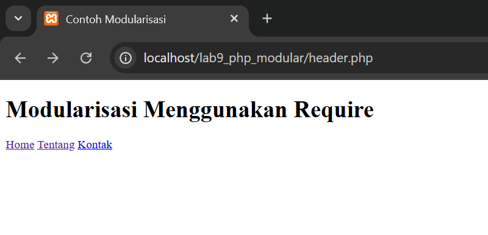
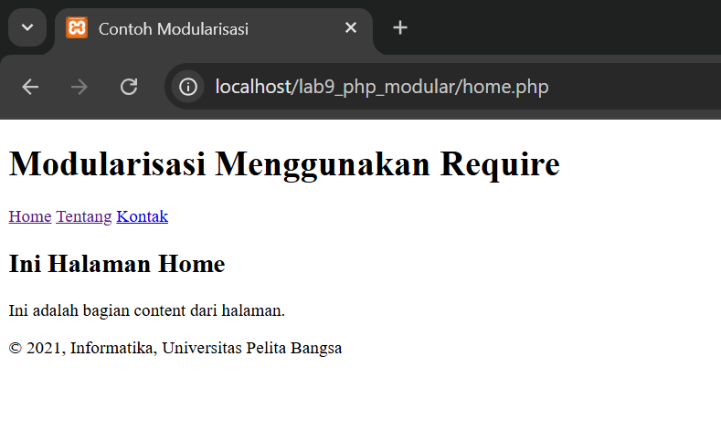
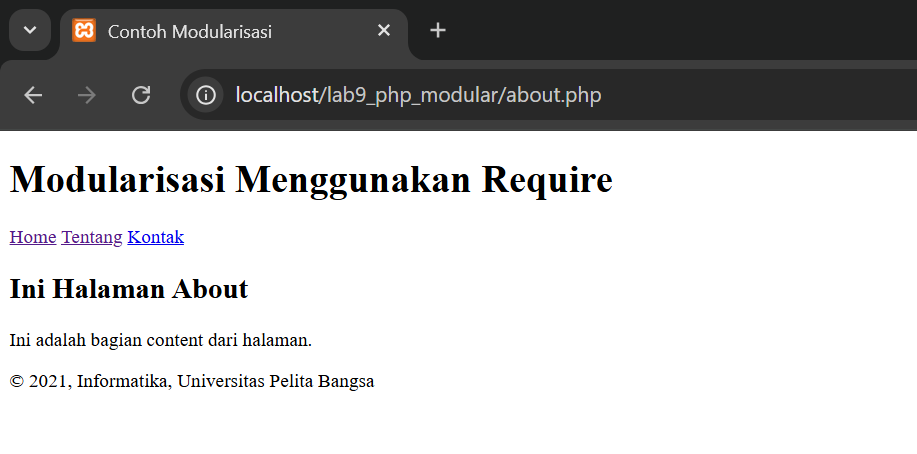
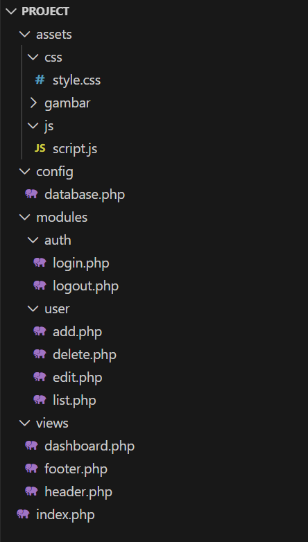
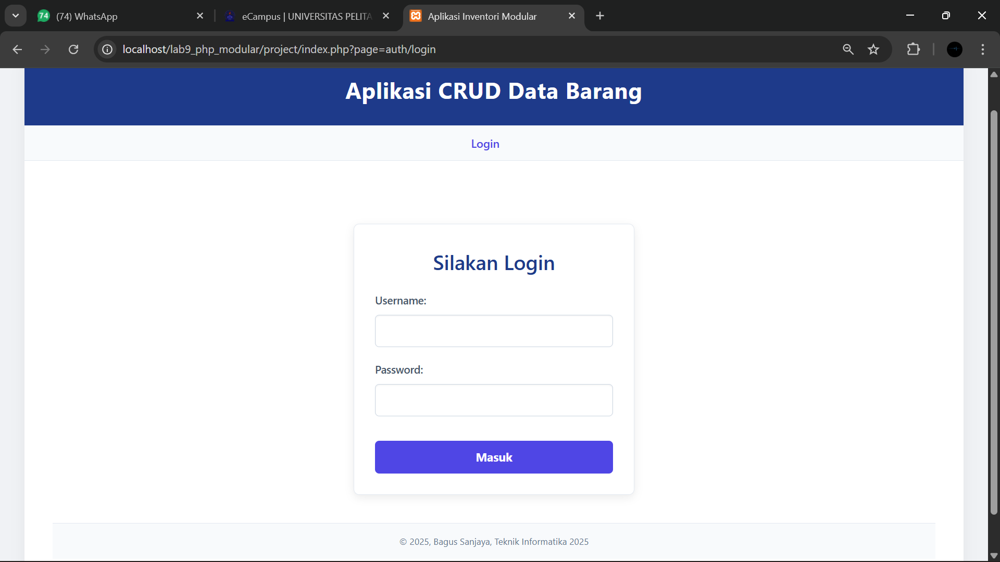
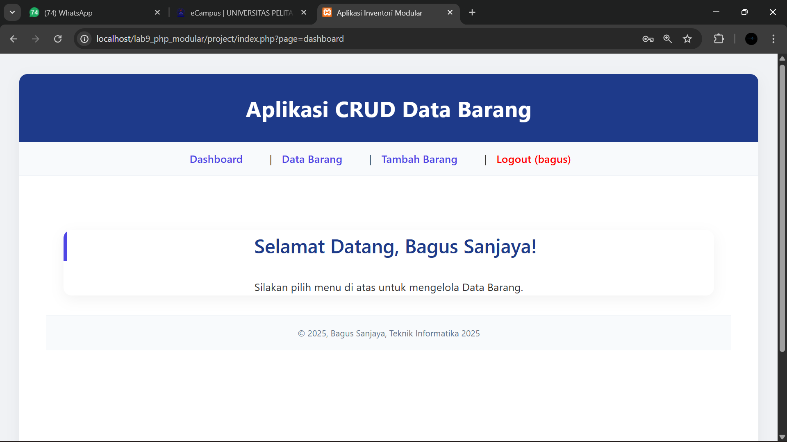
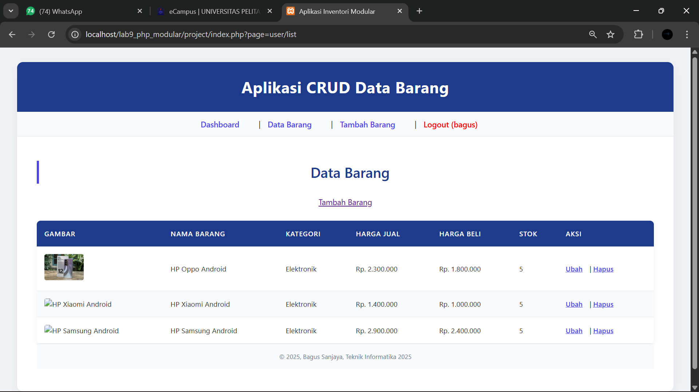
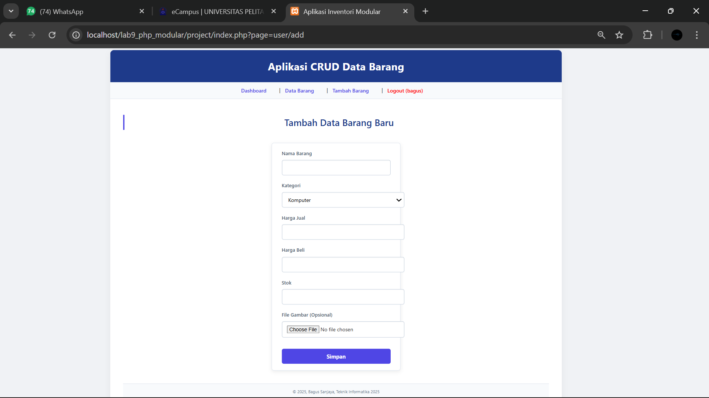
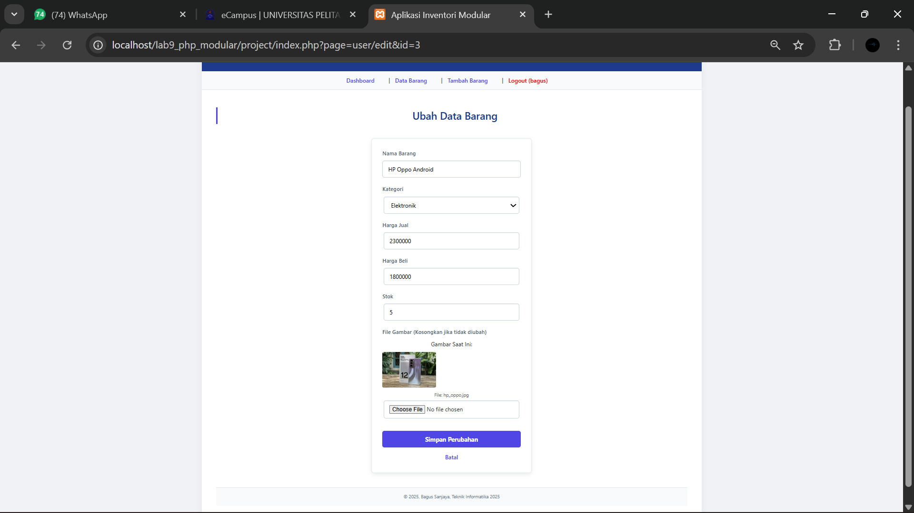

# Lab9Web

Nama : Bagus Sanjaya

Nim : 312410505

Kelas : TI.24.A.5

## Laporan Praktikum

### Lagkah-langkah Praktikum

1. Buat file baru dengan nama `header.php`

```
<!DOCTYPE html>
<html lang="en">
<head>
    <meta charset="UTF-8">
    <title>Contoh Modularisasi</title>
    <link href="style.css" rel="stylesheet" type="text/stylesheet" media="screen" />
</head>
<body>
    <div class="container">
        <header>
            <h1>Modularisasi Menggunakan Require</h1>
        </header>
        <nav>
            <a href="home.php">Home</a>
            <a href="about.php">Tentang</a>
            <a href="kontak.php">Kontak</a>
        </nav>
```



2. Buat file baru dengan nama `footer.php`

```
        <footer>
            <p>&copy; 2021, Informatika, Universitas Pelita Bangsa</p>
        </footer>
    </div>
</body>
</html>
```


3. Buat file baru dengan nama `home.php`

```
<?php require('header.php'); ?>

<div class="content">
    <h2>Ini Halaman Home</h2>
    <p>Ini adalah bagian content dari halaman.</p>
</div>

<?php require('footer.php'); ?>
```



4. Buat file baru dengan nama `about.php`

```
<?php require('header.php'); ?>

<div class="content">
    <h2>Ini Halaman About</h2>
    <p>Ini adalah bagian content dari halaman.</p>
</div>

<?php require('footer.php'); ?>
```



## Pertanyaan dan Tugas 
Implementasikan konsep modularisasi pada kode program praktikum 8 tentang database, sehingga setiap halamannya memiliki template tampilan yang sama. Dan terapkan penggunaan Routing agar project menjadi lebih modular. Gunakan struktur direktory seperti berikut: 



Routing menggunakan url: index.php?page=user/list 
 
Opsional: Gunakan htaccess agar url lebih SEO Friendly.  

Contoh URL: (base-domain)/user/list

### Jawaban Pertanyaan dan Tugas

1. Kode-kodenya bisa diakses pada folder PROJECT

2. Menampilkan login yang mengisi nama dan password sesuai dengan data



3. Tampilan dashboard yang memiliki menu untuk melihat data barang, menambah data barang, mengubah data barang dan menghapus data barang.



4. Tampilan data barang



5. Tampilan tambah data barang baru



6. Tampilan ubah data barang


